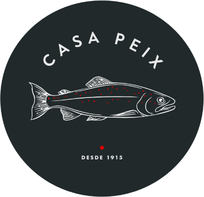
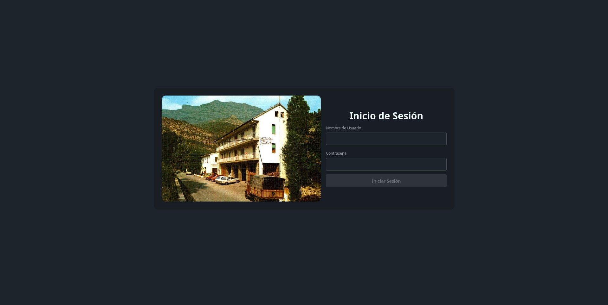
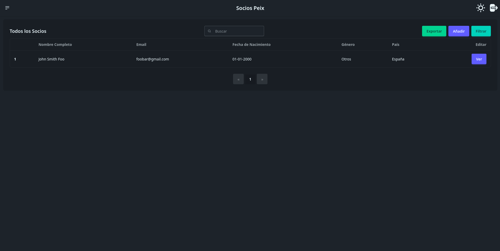
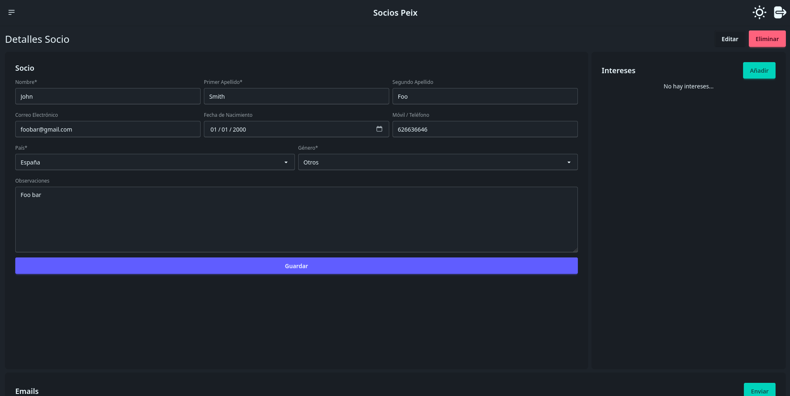
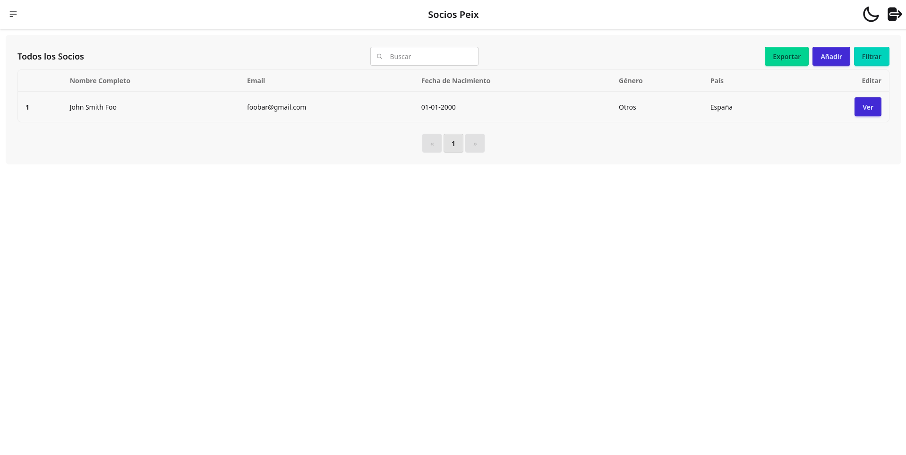

   
  
  <h1>Socios Peix</h1>

  

  <h3>Web application to manage members of a specific hotel in Spain, developed with Rust and Leptos.</h3>

  
  
  
  
  

## Notes

> [!CAUTION]
> This is just a mirror repository; development happens on a private GitLab repository.

Key features are:

- Manage members, filter them by different interests, age... 
- Export information to Excel
- Send different kinds of emails by hand or automatically

## About me

Check out my [other projects](https://github.com/mariinkys) 

You can also help do this and more projects, [Buy me a coffee](https://www.buymeacoffee.com/mariinkys)

## Copyright and Licensing

Copyright 2025 © Alex Marín

Released under the terms of the [GPL-3.0](https://github.com/mariinkys/socios-peix/blob/main/LICENSE)
